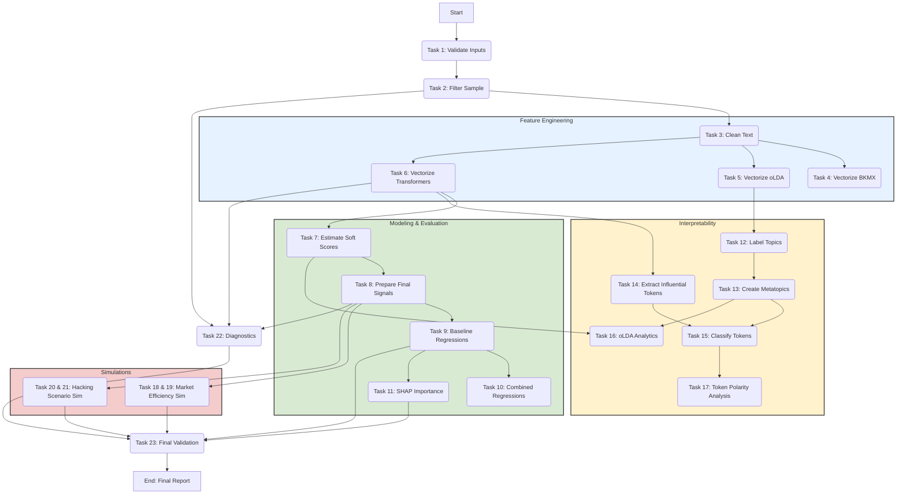

# `README.md`

# Extracting the Structure of Press Releases for Predicting Earnings Announcement Returns

<!-- PROJECT SHIELDS -->
[](https://opensource.org/licenses/MIT)
[](https://www.python.org/)
[](https://arxiv.org/abs/2509.24254)
[](https://icaif.acm.org/2025/)
[](https://github.com/chirindaopensource/extracting_structure_press_releases_predicting_earnings_announcement_returns)
[](https://github.com/chirindaopensource/extracting_structure_press_releases_predicting_earnings_announcement_returns)
[](https://github.com/chirindaopensource/extracting_structure_press_releases_predicting_earnings_announcement_returns)
[](https://github.com/chirindaopensource/extracting_structure_press_releases_predicting_earnings_announcement_returns)
[](https://github.com/chirindaopensource/extracting_structure_press_releases_predicting_earnings_announcement_returns)
[](https://github.com/chirindaopensource/extracting_structure_press_releases_predicting_earnings_announcement_returns)
[](https://github.com/psf/black)
[](http://mypy-lang.org/)
[](https://numpy.org/)
[](https://pandas.pydata.org/)
[](https://pytorch.org/)
[](https://scikit-learn.org/)
[](https://huggingface.co/)
[](https://jupyter.org/)
---

**Repository:** `https://github.com/chirindaopensource/extracting_structure_press_releases_predicting_earnings_announcement_returns`

**Owner:** 2025 Craig Chirinda (Open Source Projects)

This repository contains an **independent**, professional-grade Python implementation of the research methodology from the 2025 paper entitled **"Extracting the Structure of Press Releases for Predicting Earnings Announcement Returns"** by:

*   Yuntao Wu
*   Ege Mert Akin
*   Charles Martineau
*   Vincent Grégoire
*   Andreas Veneris

The project provides a complete, end-to-end computational framework for replicating the paper's findings. It delivers a modular, auditable, and extensible pipeline that executes the entire research workflow: from rigorous data validation and multi-stage text cleaning to multi-modal feature engineering, rolling-window predictive modeling, advanced interpretability analysis, and empirical simulations.

## Table of Contents

- [Introduction](#introduction)
- [Theoretical Background](#theoretical-background)
- [Features](#features)
- [Methodology Implemented](#methodology-implemented)
- [Core Components (Notebook Structure)](#core-components-notebook-structure)
- [Key Callable: `run_full_analysis_pipeline`](#key-callable-run_full_analysis_pipeline)
- [Workflow Diagram](#workflow-diagram)
- [Prerequisites](#prerequisites)
- [Installation](#installation)
- [Input Data Structure](#input-data-structure)
- [Usage](#usage)
- [Output Structure](#output-structure)
- [Project Structure](#project-structure)
- [Customization](#customization)
- [Contributing](#contributing)
- [Recommended Extensions](#recommended-extensions)
- [License](#license)
- [Citation](#citation)
- [Acknowledgments](#acknowledgments)

## Introduction

This project provides a Python implementation of the methodologies presented in the 2025 paper "Extracting the Structure of Press Releases for Predicting Earnings Announcement Returns." The core of this repository is the iPython Notebook `extracting_structure_press_releases_predicting_earnings_announcement_returns_draft.ipynb`, which contains a comprehensive suite of functions to replicate the paper's findings, from initial data validation to the final generation of all analytical tables and figures.

The paper investigates the predictive power of textual "soft information" in corporate earnings press releases relative to numerical "hard information" (earnings surprise). This codebase operationalizes the paper's framework, allowing users to:
-   Rigorously validate and manage the entire experimental configuration.
-   Process and clean raw HTML press releases from SEC filings.
-   Generate five distinct sets of textual features using classical and deep learning NLP models.
-   Train predictive models in a rolling-window framework to prevent look-ahead bias.
-   Perform a full suite of econometric, interpretability, and simulation analyses to replicate the paper's key tables and figures.

## Theoretical Background

The implemented methods are grounded in asset pricing, econometrics, and natural language processing.

**1. Hard vs. Soft Information:**
The study tests the relative importance of two information types:
-   **Hard Information (Earnings Surprise):** The quantitative surprise, defined as the deviation of reported earnings from analyst expectations, scaled by price.
    $$
    \text{Surprise}_{c,t} = \frac{\text{EPS}_{c,\tau} - E_{\tau-1}[\text{EPS}_{c,t}]}{P_{c,\tau-5}}
    $$
-   **Soft Information (Textual Content):** The qualitative narrative content of the press release, captured by various NLP models.

**2. Rolling-Window Lasso Regression:**
To convert high-dimensional text features into a single predictive "soft score" without look-ahead bias, a rolling-window estimation is used. For each year `t`, a Lasso regression is trained on year `t`'s data to learn a mapping from text features to returns. This model is then used to predict out-of-sample scores for year `t+1`.
$$
\hat{\mathbf{w}}_t = \arg\min_{\mathbf{w}} \left\{ \frac{1}{2N_{t}} \|\mathbf{X}_{t}\mathbf{w} - \mathbf{y}_{t}\|_2^2 + \lambda \|\mathbf{w}\|_1 \right\} \quad \implies \quad \text{SoftScore}_{t+1} = \mathbf{X}_{t+1} \cdot \hat{\mathbf{w}}_t
$$

**3. Panel Data Regression with Clustered Standard Errors:**
To assess the explanatory power of the signals, a cross-sectional regression is estimated with standard errors clustered by both firm (`permno`) and time (`ann_trade_date`). This is the standard in financial econometrics for addressing potential correlation in residuals across both dimensions.
$$
\text{Ret}_{c,\tau} = \alpha + \beta_0 \text{Surprise}_{c,t} + \beta_1 \text{Soft}_{c,t} + \epsilon_{c,\tau}
$$

## Features

The provided iPython Notebook (`extracting_structure_press_releases_predicting_earnings_announcement_returns_draft.ipynb`) implements the full research pipeline, including:

-   **Modular, Multi-Task Architecture:** The entire pipeline is broken down into 23 distinct, modular tasks, each with its own orchestrator function.
-   **Configuration-Driven Design:** All study parameters are managed in an external `config.yaml` file, allowing for easy customization and replication.
-   **Multi-Modal NLP Feature Engineering:** Complete pipeline for generating features from five different models: BKMX, Online LDA (oLDA), BERT, FinBERT, and MPNET.
-   **Econometrically Sound Modeling:** Implements rolling-window estimation to prevent look-ahead bias and uses two-way clustered standard errors for robust inference.
-   **Advanced Interpretability Suite:** Includes SHAP analysis for feature importance, and a full LLM-based pipeline (using GPT-4o) for topic labeling, taxonomy creation, and token-level attribution.
-   **Realistic Trading Simulations:** Implements a market efficiency test and a "hacking scenario" analysis with careful handling of transaction costs and market microstructure details.
-   **Automated Validation:** Concludes with a comprehensive validation step that programmatically compares all generated results against the key numerical findings reported in the source paper.

## Methodology Implemented

The core analytical steps directly implement the methodology from the paper:

1.  **Validation & Filtering (Tasks 1-2):** Ingests and validates the `config.yaml` and raw data, then applies the paper's sample selection criteria.
2.  **Text Cleaning (Task 3):** Processes raw HTML into two standardized text formats for different model types.
3.  **Vectorization (Tasks 4-6):** Generates all five sets of textual features (BKMX, oLDA, BERT, FinBERT, MPNET).
4.  **Predictive Modeling (Tasks 7-11):** Runs the rolling Lasso estimation to generate soft scores, prepares final signals, runs baseline and combined regressions, and computes SHAP importance.
5.  **Interpretability (Tasks 12-17):** Executes the full LLM-based pipeline to understand the thematic content of the oLDA and BERT-family models.
6.  **Simulations (Tasks 18-21):** Builds the tools for and executes the market efficiency and hacking scenario simulations.
7.  **Diagnostics & Final Validation (Tasks 22-23):** Computes summary statistics and visualizations, and runs a final, automated check of all results against the paper's benchmarks.

## Core Components (Notebook Structure)

The `extracting_structure_press_releases_predicting_earnings_announcement_returns_draft.ipynb` notebook is structured as a logical pipeline with modular orchestrator functions for each of the 23 major tasks. All functions are self-contained, fully documented with type hints and docstrings, and designed for professional-grade execution.

## Key Callable: `run_full_analysis_pipeline`

The project is designed around a single, top-level user-facing interface function:

-   **`run_full_analysis_pipeline`:** This master orchestrator function, located in the final section of the notebook, runs the entire automated research pipeline from end-to-end. A single call to this function reproduces the entire computational portion of the project, from data validation to the final report.

## Workflow Diagram

The following diagram illustrates the high-level workflow orchestrated by the `run_full_analysis_pipeline` function.



## Prerequisites

-   Python 3.9+
-   An OpenAI API key set as an environment variable (`OPENAI_API_KEY`).
-   Core dependencies: `pandas`, `numpy`, `scikit-learn`, `statsmodels`, `torch`, `transformers`, `beautifulsoup4`, `lxml`, `pyyaml`, `linearmodels`, `shap`, `joblib`, `nltk`, `openai`.

## Installation

1.  **Clone the repository:**
    ```sh
    git clone https://github.com/chirindaopensource/extracting_structure_press_releases_predicting_earnings_announcement_returns.git
    cd extracting_structure_press_releases_predicting_earnings_announcement_returns
    ```

2.  **Create and activate a virtual environment (recommended):**
    ```sh
    python -m venv venv
    source venv/bin/activate  # On Windows, use `venv\Scripts\activate`
    ```

3.  **Install Python dependencies:**
    ```sh
    pip install -r requirements.txt
    ```

4.  **Set up API Keys:** Follow the instructions in the notebook or documentation to set your `OPENAI_API_KEY` as an environment variable.

## Input Data Structure

The pipeline requires a `pandas.DataFrame` with a specific, comprehensive schema containing over 70 columns of event, market, and text data. The exact schema is validated by the `_validate_dataframe_schema` function in the notebook. All other parameters are controlled by the `config.yaml` file.

## Usage

The `extracting_structure_press_releases_predicting_earnings_announcement_returns_draft.ipynb` notebook provides a complete, step-by-step guide. The primary workflow is to execute the final cell of the notebook, which calls the top-level `run_full_analysis_pipeline` orchestrator:

```python
# Final cell of the notebook

# Define paths and load data/config
DATA_PATH = Path('path/to/your/data.parquet')
CONFIG_PATH = Path('config.yaml')
ARTIFACTS_PATH = Path('./study_artifacts')

# Load data and configuration
events_df = pd.read_parquet(DATA_PATH)
raw_events_df = events_df.copy()
with open(CONFIG_PATH, 'r') as f:
    study_params = yaml.safe_load(f)

# Run the entire study
final_results = run_full_analysis_pipeline(
    events_df=events_df,
    raw_events_df=raw_events_df,
    study_params=study_params,
    artifacts_path=ARTIFACTS_PATH
)

# The `final_results` dictionary will contain all key outputs.
```

## Output Structure

The `run_full_analysis_pipeline` function returns a comprehensive dictionary containing all major results. Additionally, it creates an `artifacts_path` directory with the following structure for persisted models and embeddings:

```
study_artifacts/
│
├── token_embeddings/
│   ├── bert/
│   │   ├── event_id_1.pt
│   │   └── ...
│   ├── finbert/
│   └── mpnet/
│
└── lasso_models/
    ├── bkmx/
    │   ├── 2005.pkl
    │   └── ...
    ├── olda/
    ├── bert/
    ├── finbert/
    └── mpnet/
```

## Project Structure

```
extracting_structure_press_releases_predicting_earnings_announcement_returns/
│
├── extracting_structure_press_releases_predicting_earnings_announcement_returns_draft.ipynb # Main implementation notebook
├── config.yaml                                                                              # Master configuration file
├── requirements.txt                                                                         # Python package dependencies
├── LICENSE                                                                                  # MIT license file
└── README.md                                                                                # This documentation file
```

## Customization

The pipeline is highly customizable via the `config.yaml` file. Users can easily modify all study parameters, including date ranges, model hyperparameters, LLM prompts, and simulation settings, without altering the core Python code.

## Contributing

Contributions are welcome. Please fork the repository, create a feature branch, and submit a pull request with a clear description of your changes. Adherence to PEP 8, type hinting, and comprehensive docstrings is required.

## Recommended Extensions

Future extensions could include:
-   **Alternative Textual Features:** Integrating other feature extraction methods like TF-IDF or different Transformer architectures.
-   **Non-Linear Models:** Replacing the Lasso regression with more complex models like Gradient Boosting Machines or Neural Networks to capture non-linear relationships between text and returns.
-   **Expanded Interpretability:** Using more advanced SHAP explainers (e.g., `KernelExplainer`) for non-linear models or other techniques like LIME.
-   **Dynamic Strategy Simulation:** Extending the trading simulation to allow for dynamic position sizing or holding periods based on signal strength.

## License

This project is licensed under the MIT License.

## Citation

If you use this code or the methodology in your research, please cite the original paper:

```bibtex
@inproceedings{wu2025extracting,
  author    = {Wu, Yuntao and Akin, Ege Mert and Martineau, Charles and Gr\'{e}goire, Vincent and Veneris, Andreas},
  title     = {Extracting the Structure of Press Releases for Predicting Earnings Announcement Returns},
  booktitle = {Proceedings of the 6th ACM International Conference on AI in Finance},
  series    = {ICAIF '25},
  year      = {2025},
  publisher = {ACM},
  note      = {arXiv:2509.24254}
}
```

For the implementation itself, you may cite this repository:
```
Chirinda, C. (2025). A Professional-Grade Implementation of the "Extracting Structure of Press Releases" Framework.
GitHub repository: https://github.com/chirindaopensource/extracting_structure_press_releases_predicting_earnings_announcement_returns
```

## Acknowledgments

-   Credit to **Yuntao Wu, Ege Mert Akin, Charles Martineau, Vincent Grégoire, and Andreas Veneris** for the foundational research that forms the entire basis for this computational replication.
-   This project is built upon the exceptional tools provided by the open-source community. Sincere thanks to the developers of the scientific Python ecosystem, including **Pandas, NumPy, Scikit-learn, PyTorch, Hugging Face, Statsmodels, Linearmodels, SHAP, and Jupyter**.

--

*This README was generated based on the structure and content of the `extracting_structure_press_releases_predicting_earnings_announcement_returns_draft.ipynb` notebook and follows best practices for research software documentation.*
